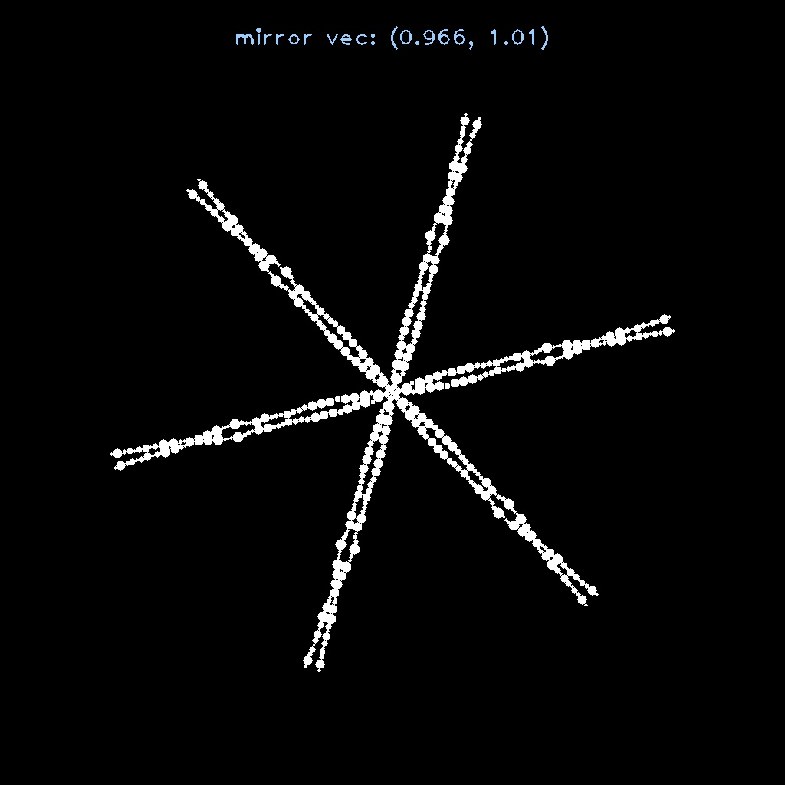
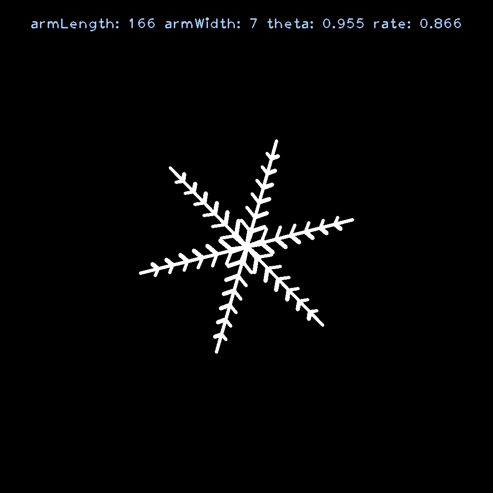
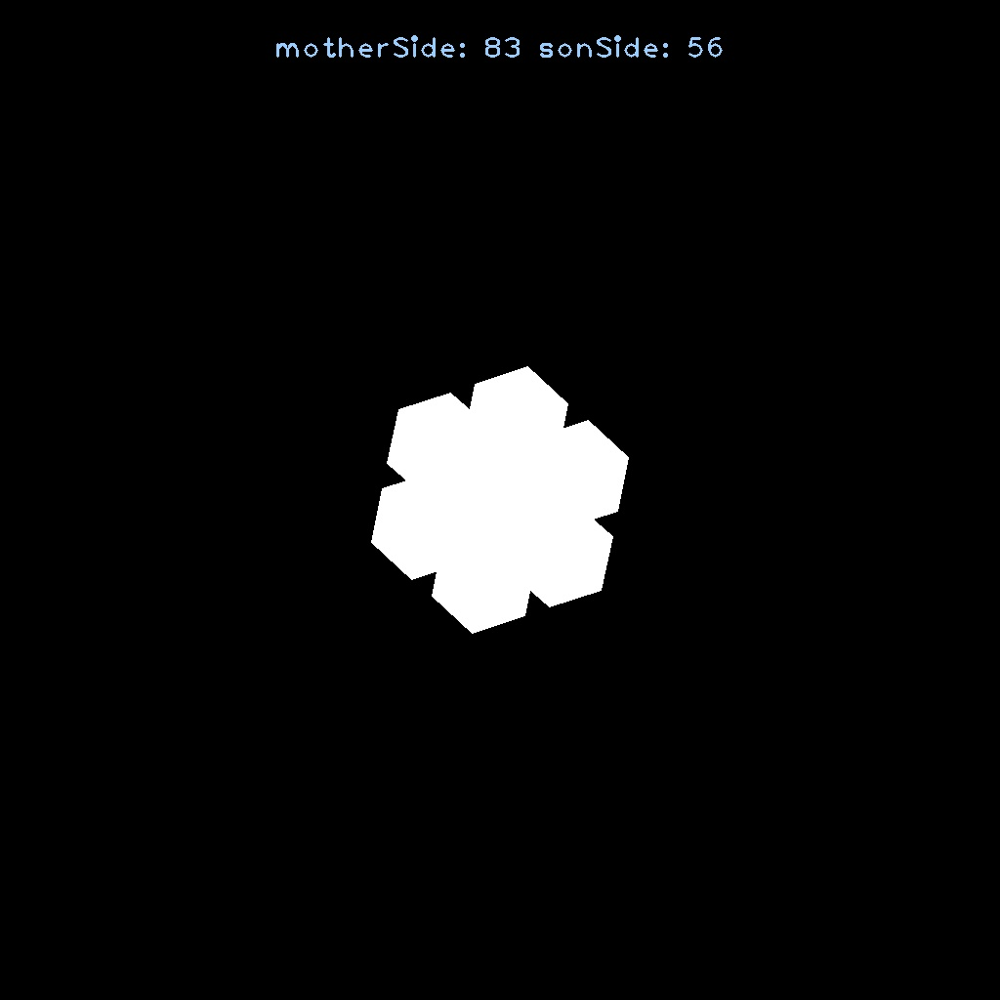
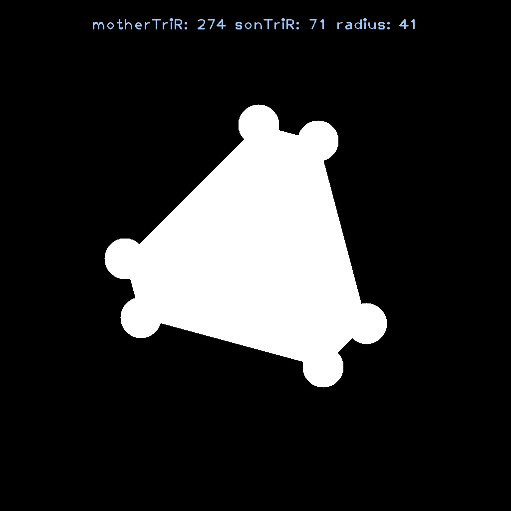

# Snowflakes

This project builds snowflakes so that Santa Clause and his elfs can focus on sending gifts to kids instead of making snowflakes.

## Requirements

The requirements are:

- CMake 3.11 or better; 3.14+ highly recommended
- A C++17 compatible compiler
- The Boost libararies
- Git
- OpenCV
- Doxygen (optional, highly recommended)

## Instructions

To configure:

```bash
cmake -S . -B build
```

Add `-GNinja` if you have Ninja.

To build:

```bash
cmake --build build
```

To test (`--target` can be written as `-t` in CMake 3.15+):

```bash
cmake --build build --target test
```

To run exe
```
./build/apps/app <snowflake_type> <additional_arguments>
```

To build and run exe
```
cmake --build build && ./build/apps/app
```

To build and test
```
cmake --build build && cmake --build build --target test
```

To build docs (requires Doxygen, output in `build/docs/html`):

```bash
cmake --build build --target docs
```

## Snowflake Type

The following snowflake types are available for the user to select:

* Crystal

```
./build/apps/app crystal
```

* Radiating Dendrite

```
./build/apps/app radiating-dendrite
```

* Stellar Plate

```
./build/apps/app stellar-plate
```

* Triangular Crystal

```
./build/apps/app triangular-crystal
```

## Additional Arguments

* help

Show the help menu:

```
./build/apps/app --help [-h]
```

* snowflake

Choose the type of snowflake (the default type is ***Crystal***):

```
./build/apps/app --snowflake [-s]
```

* output

Specify the output directory (the default directory is ***Snowflakes/outputs/***):

```
./build/apps/app --output [-o]
```

* number

Pick the number of output images (the default value is ***10***):

```
./build/apps/app --number [-n]
```

* default

Use the default paramters for the snowflakes (the default value is ***false***); otherwise, parameters will need to be entered from the console:

```
./build/apps/app --default [-d]
```

## Example Outputs

* Crystal

<figure>
    <p align="center">
        
    </p>
    <figcaption align="center">A crystal snowflake with mirror vector of (0.97, 1.01).</figcaption>
</figure>

* Radiating Dendrite

<figure>
    <p align="center">
        
    </p>
    <figcaption align="center">A radiating dendrite snowflake with mirror vector of (0.97, 1.01).</figcaption>
</figure>

* Stellar Plate

<figure>
    <p align="center">
        
    </p>
    <figcaption align="center">A stellar plate snowflake with mirror vector of (0.97, 1.01).</figcaption>
</figure>

* Triangular Crystal

<figure>
    <p align="center">
        
    </p>
    <figcaption align="center">A triangular crystal snowflake with mirror vector of (0.97, 1.01).</figcaption>
</figure>

## Reference

* https://www.its.caltech.edu/~atomic/snowcrystals/class/class-old.htm
